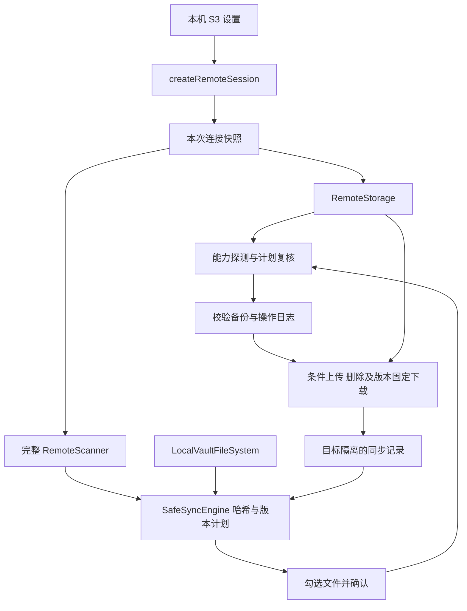

# JASync 设计与实现状态

更新时间：2026-09-27。本文对应 **JASync 0.2.7**，记录已实现行为与剩余边界。产品为 Obsidian 的 S3 同步插件，开发目录与包名为 `obsidian-jasync`；当前 GitHub 远端为 `guojuntech/obisidian-jasync`，沿用现有仓库名。

## 1. 当前决策

按照最新产品决定，JASync **只支持 S3**。坚果云是代码上游，不再是运行时服务或可选同步后端。

- 保留 Nutstore 上游的同步策略、任务预览、确认交互、过滤和冲突处理组织方式。
- 移植 Alipan 的 RemoteStorage 抽象方式；不接入阿里云盘。
- 移除坚果云 SSO、`@nutstore/sso-js`、WebDAV、专属增量 API、远端遍历缓存、企业地址设置和 AI 网关。
- 保留用户自行配置的通用 AI/MCP 代码，不再依赖坚果云账号或网关；当前隐藏 AI 设置页和左侧 Open ChatBox 按钮。
- 插件显示名称为 JASync，包名为 `obsidian-jasync`，插件 ID 为 `jasync`。0.2.6 统一配置目录、协议、样式和内部命名，采用全新安装，不迁移旧版配置、缓存或同步记录。

此前文档中“先适配并保留 Nutstore 后端”的方案被上述决定替代；仍保留上游 Git 历史，便于吸收后续改进。

## 2. 基线与实施阶段

| 项目     | 固定来源                                                                             |
| -------- | ------------------------------------------------------------------------------------ |
| 主上游   | `nutstore/obsidian-nutstore-sync`，`79d35b4e8b47ac43d3531ceb888a722ee942dc5e`，1.5.0 |
| 抽象参考 | `nowszhao/obsidian-alipan-sync`，`dccb5b55ea015bda793eb1f2e730adbd578d5660`，1.1.11  |
| 许可     | 保留 AGPL-3.0 及上游来源说明，见 LICENSE / NOTICE.md                                 |
| 提交约定 | 本项目提交信息统一以 `[guojuntech]` 开头                                             |

| 阶段 | 内容                                                    | 当前状态                                                      |
| ---- | ------------------------------------------------------- | ------------------------------------------------------------- |
| P0   | 依赖、构建和基线验证                                    | 已移除私有包依赖；保留 Git LFS 模型目录；构建与单元测试可运行 |
| P1   | RemoteStorage / RemoteScanner、会话注入、去除坚果云依赖 | 已接通同步协调器、任务、目录浏览、下载及记录更新              |
| P2   | S3 配置、签名、完整列举、元数据、读取和计划预览         | 已实现并通过模拟协议及流程测试；真实 S3 服务验收待完成        |
| P3   | 安全执行、条件写删、复核、恢复与精确记录                | 已实现；手动确认后按文件执行，失败即停止                      |
| P4   | 移动端、兼容服务、性能与发布验收                        | 待完成，不声明所有兼容 S3 服务均已验证                        |

**当前 0.2.7 已开放同步执行。** 手动同步在存在待审核项目时显示可勾选计划，确认后执行；关闭或取消计划不会写入。全部文件一致且已有匹配的共同基准时，扫描比对后直接完成；仅首次建立或需要更新的共同基准继续校验并保存记录。自动同步默认关闭，并对冲突、批量删除及不支持条件写入的服务保留手动审核。

## 3. 架构与注入

`src/remote-storage/factory.ts` 是具体后端的装配入口。本次创建的 session 包含 storage、scanner、identity、逻辑根目录和运行模式。配置在创建时复制并固定，修改设置不会改变进行中的请求目标。

同步核心依赖公共契约，不创建 WebDAV 客户端或调用 S3 transport。`BaseTaskOptions.remoteStorage` 是必填项，不允许用可选字段隐藏连接缺失。记录更新接收原有的远端文件系统，不再次从实时设置构造连接。通用缓存生命周期保留为可选扩展；S3 当前每次完整扫描，不使用远端缓存。

`sync/safe/runner.ts` 负责阶段切换、确认、取消和执行编排；`sync/safe/engine.ts` 负责计划、复核、备份和按文件提交记录。`PlannedTask` 仅适配现有文件列表展示，不能通过其 `exec()` 绕过安全执行器。

内部插件、设置和协调器类型已采用 JASync 命名。运行界面不显示 Nutstore 名称；许可与来源说明保留上游署名。0.2.6 将插件 ID、配置目录、数据库、协议链接、视图 ID、样式类、内置帮助及临时文件命名统一为 JASync；按用户决定全新安装，不提供旧状态迁移逻辑。

## 4. Alipan 抽象移植映射

| 参考位置 / 模式                                    | JASync 实现                                                              |
| -------------------------------------------------- | ------------------------------------------------------------------------ |
| `remote-storage.interface.ts` 的抽象类和 CRUD 命名 | 同路径；异步 I/O 统一返回 Promise，二进制使用 ArrayBuffer / Uint8Array   |
| `remote-storage/index.ts` 统一入口                 | 公共类型导出，不导出具体 S3 客户端                                       |
| 通用远端文件系统                                   | `fs/remote-storage.ts`；注入 scanner 与固定过滤规则                      |
| 任务中注入 remoteStorage                           | `sync/tasks/task.interface.ts`；覆盖上传、下载、合并、目录和删除任务     |
| 决策器中创建任务                                   | `sync/decision/base.decider.ts` 一次接入，覆盖双向与单向策略             |
| 插件创建存储实例                                   | 演进为 `createRemoteSession`，统一固定连接身份和目标                     |
| 分块下载                                           | `utils/chunked-download.ts` 使用通用范围读取结果，不再调用 customRequest |
| 目录浏览                                           | 保留浏览组件，改用公共存储接口；当前隐藏新建目录入口                     |
| 增量能力                                           | 从必选 CRUD 接口中移除；完整扫描由 RemoteScanner 负责                    |

本项目实现的契约比参考接口严格：上传不是 boolean，读取不是裸 Buffer，不存在与请求失败不混用，文件删除与递归目录删除明确区分。

## 5. 存储与扫描契约

### RemoteStorage

- `stat` 返回 StatModel 和可选 RemoteVersion。ETag 是不透明版本信息，不当成内容 MD5。
- `exists` 只有 NotFound 返回 false；权限、网络、协议错误继续抛出。
- `getFileContents` 返回二进制、实际版本和范围信息，可接受预期 ETag / VersionId。返回的版本也必须匹配，不能信任服务忽略条件后的 200 响应。
- `putFileContents` 显式指定 create / overwrite 意图，可携带预期版本；成功结果保留写入响应版本位置。不得用写入后 stat 冒充写入回执。
- `deleteFile` 仅面向单个文件对象；递归目录删除是单独的方法，默认不支持。S3 禁止隐式递归扩删。
- 能力状态区分 supported、unsupported、unknown。探测前为 unknown；确认计划后在随机私有探测对象上分别验证创建、覆盖和删除的条件语义。
- 错误类型区分不存在、认证/权限、冲突、前置条件、能力不支持、响应异常、网络、限流与取消。

### RemoteScanner / RemoteStorageFileSystem

扫描成功必须返回 `{ complete: true, entries }`。分页失败、取消或协议异常抛出错误，不返回部分数据。文件系统层再次检查完整性，随后转换为 vault 相对路径、应用过滤并补齐必要父目录。

保留“被忽略”与“已删除”的区分。排除项仍可带 `ignored: true` 进入决策输入，不能因为过滤而被误认为远端丢失。

一次完整列举不是原子快照。执行前逐文件复核本地 SHA-256 和远端 ETag/大小，不能以成功列举替代执行前校验。

## 6. S3 实现

### 配置与 HTTP

配置包括 endpoint、region、bucket、prefix、accessKeyId、secretAccessKey、sessionToken 与 path-style 开关。空 endpoint 使用对应 region 的 AWS S3 地址；显式 endpoint 必须是 HTTP(S) origin，拒绝内嵌凭据、路径、query 和 fragment。

`Use path-style addressing` 默认关闭：Bucket 加在 endpoint 主机名前；开启后 Bucket 放入 URL 路径。该开关影响请求地址、签名和连接身份，不能作为单纯的界面选项处理。不会覆盖用户已保存的开关值。

使用 [aws4fetch](https://github.com/mhart/aws4fetch) 的 SigV4 签名能力，通过可注入 transport 调用 Obsidian `requestUrl`；不借助 Node 文件系统或浏览器跨域 fetch。默认 transport 不记录签名请求和凭据。

只读请求对 429 / 500 / 502 / 503 / 504 做有限重试；鉴权、404、412 不重试。取消检查在分页前后及请求返回后执行。目前 Obsidian 底层请求不支持主动终止，取消会拒绝其结果并停止后续页面，不宣称请求已经从网络中撤回。

### 路径与目录

逻辑根目录恒为 `/`。S3 key 为规范 prefix 加 vault 相对路径。非空 prefix 必须以 `/` 结束，以区分 `vault/` 和 `vault-other/`。对象 key 不经过路径 normalize；URL 按路径段编码，列表使用 `encoding-type=url` 并只解码一次。

设置页的 Prefix 输入框是唯一同步根目录配置，保存到本机 S3 设置，在建立 session 时去除首尾 `/` 后统一补末尾 `/`。已移除第二层 Select Prefix / 子目录选择入口。确认窗口展示实际 Bucket 与 Prefix；任务列表中的远端路径相对于该 Prefix，因此 `/note.md` 表示 `<prefix>note.md`，不是忽略 Prefix 写入 Bucket 根目录。

目录从文件 key 推导；支持零字节 `/` 结尾目录标记。非零字节目录标记、文件/目录同名、重复对象、大小写和 NFC Unicode 别名冲突均中止扫描。拒绝 `..`、空路径段、反斜杠、控制字符及无法可靠映射到跨平台 vault 的文件名，不静默重命名。

### 列举与读取

使用 [ListObjectsV2](https://docs.aws.amazon.com/AmazonS3/latest/API/API_ListObjectsV2.html)，扫描耗尽全部 continuation token。缺失或重复分页 token、无效 XML、缺失关键元数据均失败。目录浏览当前从完整快照构建一级视图，后续可优化成 delimiter 分页；不能牺牲错误传播和完整性。

[GetObject](https://docs.aws.amazon.com/AmazonS3/latest/API/API_GetObject.html) 支持完整文件与 Range。范围请求核对 206、Content-Range 的起止/总长、实际字节长度；完整读取拒绝意外的部分响应。条件读取验证响应 ETag / VersionId。

当前使用内存中的二进制响应，不包含分片上传、大文件流式传输或历史版本 UI。不同 S3 兼容服务的请求头、签名、范围与条件能力仍须实测。

## 7. 同步计划与执行

生产入口 `SyncExecutorService` 调用 `sync/safe/runner.ts` 和 `SafeSyncEngine`。保留上游任务、决策器和只读预览测试供后续对照，但不使用旧执行器执行 S3 写操作。计划的 UI 继续复用上游可勾选任务列表和进度窗口。

- 以 SHA-256 建立两侧共同基准；只有记录中的 ETag 和大小仍匹配时才复用远端内容哈希。没有基准的同名同大小文件也需要内容比较，废弃 Loose 模式的大小相等推断。
- 确认前只列举和读取；确认后重新检查连接身份和全部选中文件。每个操作在备份后再次复核，发现修改立即停止并要求重新生成计划。
- 创建使用 `If-None-Match: *`；COS 官方域名使用 `x-cos-forbid-overwrite: true`，不混发通用创建条件头。覆盖/删除使用 `If-Match`。上传保存响应中实际返回的 ETag/VersionId，不能用事后 HEAD 冒充回执。修改请求不自动重试，丢失响应视为结果不确定。
- 下载绑定 ETag，逐块校验范围和版本，最后校验 SHA-256。写入临时文件并读取验证，现有可见 UTF-8 小文件通过 `Vault.process` 检查最新内容并替换；二进制、隐藏文件和大文本使用 adapter/Vault 写入与最后一次内容复核。
- 本地与远端被覆盖/删除的内容均在本机 recovery 保存并校验，日志先记录 pending。备份或记录保存失败即停止，保留日志及副本。记录只表示已实际完成的文件，不将上传期间产生的新编辑记为已同步。
- 只执行明确批准的文件。取消后停止后续操作，不回滚已经完成的文件；在途请求无法从网络撤回，收到成功回执的单个操作仍记录实际结果。禁止递归删除，空文件夹不会单独同步。一次至少 10 个文件的删除需要再次确认。
- 默认冲突策略与 Diff3 都只在存在经哈希验证的共同文本版本时尝试三方合并；无共同版本或有重叠冲突时，把本地版本保存为 `.conflict-<UUID>`，原路径保留远端版本，两份同步到两侧。优先本地/远端策略仍在备份后覆盖。

### 0.2.5：复用未变化文件的共同基准

此前每个一致文件在计划完成后仍经过全量 Recheck、执行入口校验和记录前校验，额外发送 3 次串行 HEAD 并重复读取本地内容。现在将文件分为三类：

- **已有匹配基准的一致文件**：本次内容比对结果与历史哈希、两侧大小、远端 ETag 一致，且远端若提供 VersionId 也一致，直接保留原记录。列表没有 VersionId 时不将其视为版本发生变化。没有额外远端请求、本地重读或状态重写。
- **需要新建或刷新基准的一致文件**：没有历史记录、两侧同时改为相同内容、远端版本改变，或两侧均删除但旧记录仍在。保存或清理记录前各校验本地和远端一次，不经过文件写删所需的重复复核与备份。
- **实际修改文件的任务**：只复核本次已批准的上传、下载、覆盖、删除及冲突任务。保留全局执行前检查、备份后再次检查、条件写删和逐文件记录。

这不是基于文件大小或 mtime 猜测相等：完整远端列举、本地 SHA-256 和必要的远端内容读取仍保留。若文件在计划后被其他客户端修改，快速路径不会覆盖它或把新内容写入基准；原记录保留，下一轮仍能识别变化。首次同步无法使用没有建立的历史记录。

已有记录的 20 个未变化文件与 0.2.4 的同场景协议对比：S3 请求从 61 次降为 1 次，本地读取从 100 次降为 20 次，两者均不写同步记录；实际列举请求数仍取决于分页。当前不缓存跨会话的写入能力、不新增并发，也不削弱实际写删前的校验。

### S3 兼容模式

[AWS PutObject](https://docs.aws.amazon.com/AmazonS3/latest/API/API_PutObject.html) 和 [DeleteObject](https://docs.aws.amazon.com/AmazonS3/latest/API/API_DeleteObject.html) 定义条件写删；兼容服务不一定实现相同语义。[腾讯 COS PUT 文档](https://cloud.tencent.cn/document/product/436/7749) 的 `x-cos-forbid-overwrite` 在开启/暂停版本控制时不生效，不能仅凭服务名称宣称支持。

确认计划后，使用本次专属 `.jasync-internal/probes/<UUID>` 对象，同时验证条件成立时成功、不成立时拒绝，并回读核对内容/版本或确认对象不存在；结束时尝试清理该对象。探测中的 HTTP 304 视为未验证支持，不当成写入成功。403 等权限错误直接失败，不作为兼容回退依据。探测路径永不进入笔记同步。

若所需条件不被支持，手动流程显示第二次明确确认：保留备份并紧邻写入前复核，但其他客户端在检查与写入之间的新修改仍可能被覆盖。用户应暂停其他同步客户端；同意只对本次生效，不存为全局开关。兼容模式仅移除该操作未通过验证的条件头，其他已验证的条件保护继续保留；真实文件的失败写入不自动降级重试。自动同步遇到该情况停止并提示手动审核。此处有意替代早期“永不降级”的设计，以支持用户明确选择的 COS 等服务；不宣称兼容模式具备原子并发保护。

### 自动同步和边界

实时、启动及定时触发默认关闭；从 0.1.0 升级也会关闭原本无效的自动触发设置。已支持条件语义的非冲突增量更新可自动执行；冲突、受保护删除、批量删除和兼容模式需要手动审核。

本地 adapter 并非跨平台比较并交换接口：文本 `Vault.process` 可检测序列化窗口内的编辑；二进制或外部程序在最后复核与写入间修改仍存在竞争窗口，恢复副本不是全局事务。当前默认跳过 30 MB 以上文件，内容和分块最终都在内存组装，没有分片上传、断点续传和历史版本浏览。

## 8. 状态、凭据与隔离

- 产品配置目录：`.obsidian/plugins/jasync/`（以实际 configDir 为准）。
- S3 配置与凭据保存于本机 `data.local.json`，不进入可同步设置；当前未加密，不宣称密钥保险库能力。
- 数据库名称：`JASync_Plugin_Cache`，不复用上游或旧版自身数据库，不自动迁移缓存。
- 0.2.6 按全新插件安装，清理旧版配置、cache 和 recovery 后重新配置 S3，生成新的 vaultId 与同步基准。卸载不删除笔记正文或远端对象；首次同步需审核计划。
- 旧名称只保留在 `src/legacy-identity.ts` 用于硬排除旧私有目录、临时下载及遗留探测对象，不用于写入或读取旧配置。
- 同步记录 key 包含本地 vaultId 和连接 identity。identity 哈希包含后端、endpoint、region、bucket、prefix、账号标识和寻址方式，不包含 secret key / session token。
- 不自动导入旧坚果云同步记录。更换目标不会继承旧目标的删除依据。
- 配置目录同步强制排除本插件的 `data.json`、`data.local.json`、cache、recovery，以及下载临时文件；用户 include 规则不能覆盖这些系统规则。
- 读取本地配置失败时保留原文件并报错，不以默认空凭据覆盖损坏文件。

新记录采用 format 2，保存在本插件 cache/sync-v2-<身份哈希>.json；损坏格式和不安全路径直接拒绝。恢复副本不自动过期，用户验收后可手动清理。复制整个 vault 时应为另一设备重新配置本机身份与凭据，不导入旧后端记录。

### 0.2.6：全新安装与多设备部署

新安装只包含 `main.js`、`manifest.json`、`styles.css`、LICENSE 和 NOTICE.md，安装到 `<configDir>/plugins/jasync/`。包内不包含凭据、设备身份、同步记录或恢复副本。插件 ID 由 manifest 决定，安装目录名需与 `jasync` 一致。

从旧 ID 切换的本次操作采用卸载重装：先停止同步并关闭 Obsidian，清理旧插件目录及其配置、缓存、恢复副本和专属数据库，移除旧启用项及快捷键，再安装并启用新插件。这是明确请求下的一次本地清理，发布包不会自动删除旧数据，也不包含清理插件或缓存迁移代码。清理范围不包含笔记正文、其他插件状态或 S3 对象。

首次加载生成新的 vaultId，S3 配置为空，实时、启动及定时同步默认关闭。重新配置同一 Bucket / Prefix 也不会继承旧共同基准：首次扫描需重新比较内容，缺失文件不能直接解释为已删除，同路径内容分歧可能形成冲突。必须检查新计划后再执行，不能将重新安装当作普通增量同步。

其他设备各自安装插件并填写 S3 配置，同步同一笔记库时使用同一 Bucket / Prefix。新空库可先使用普通 Receive Only 下载，完成后切换 Two Way；已有笔记的目标库需审核本地差异。每台设备独立生成身份和记录，不复制其他设备的 `data.local.json`、cache 或 recovery。移动端实机兼容性仍待验证。

## 9. 交互、验证与维护

### 持续进度与窗口生命周期

0.2.4 修复了“扫描窗口消失后长时间无反馈”的问题：此前生成计划后无条件关闭进度窗口，接下来串行执行能力探测与逐文件复核，直到传输时才重新显示。全部文件一致时没有文件确认窗口，等待尤其明显；内容比对与最终记录维护也缺少逐文件反馈。

现在由协调器发出阶段事件，`ProgressService` 保存当前状态并节流刷新，阶段变化立即刷新；`SyncProgressModal` 和状态栏消费同一组阶段信息。新的同步开始时停止上次完成时间的定时刷新，防止覆盖当前进度。

| 阶段               | 触发与显示                                                               | 窗口行为                                                  |
| ------------------ | ------------------------------------------------------------------------ | --------------------------------------------------------- |
| 策略确认           | `confirmBeforeSync` 开启时，先选择本次策略                               | 确认只开始准备，不批准实际文件写删                        |
| 本地 / S3 扫描     | 本地文件扫描提示；远端已读页数与发现对象数                               | 手动同步显示进度；总量未知时显示循环进度条                |
| 内容比对           | 比对本地 SHA-256 与远端内容 / 已有基准，显示已处理数、总文件数和当前路径 | 持续显示，完成后才准备文件确认                            |
| 文件确认           | 有待审核项目时展示可勾选列表                                             | 进度窗口让位给确认窗口；关闭、Escape 或取消均停止本次操作 |
| 写入能力检查       | 需要远端写删时执行私有对象探测                                           | 文件确认通过后立即恢复进度，显示检查提示和循环进度条      |
| 额外确认           | 批量删除或所需条件语义不受支持                                           | 暂时切换到对应确认窗口；通过后恢复进度                    |
| 同步前复核         | 再查目标身份、本地内容与远端版本，显示当前文件和计数                     | 只对实际修改任务显示；已有匹配基准的一致文件跳过          |
| 文件传输           | 显示当前任务、已完成文件和传输任务进度                                   | 继续使用进度窗口；无传输任务时不显示虚假的传输阶段        |
| 记录维护           | 仅复核需要新建或刷新基准的一致文件，显示当前路径和计数                   | 不把传输任务达到 100% 当作整次同步完成                    |
| 完成 / 失败 / 取消 | 全部工作完成后报告成功；异常报告失败；取消停止后续工作                   | 完成和失败保留结果，取消关闭进度窗口                      |

文件计数只表示当前阶段完成比例，不是整次同步的预计剩余时间。准备阶段使用紧凑布局，隐藏空文件列表，避免出现大面积空白。Hide / 关闭进度窗口只隐藏界面，不取消同步；随后阶段不会自行重新弹出，用户可通过 Show sync progress 命令恢复。停止按钮继续可用，但在途网络请求仍需返回或超时，不能承诺立即撤回。

自动运行不会自行弹出进度窗口；需要额外批准的工作按既有规则转为手动审核。0.2.5 省略无需执行的复核与记录阶段，已有匹配基准且没有变化时从比对直接进入完成。内容哈希和实际修改前的保护继续保留，首次同步与变化文件的耗时仍取决于文件数量、内容大小和服务响应速度。

### 品牌与界面

- 左侧同步入口和启动命令使用 `Start JASync`，图标为矢量 JA 字母与双箭头，使用主题颜色。
- 同步中只旋转外围箭头，字母保持正向；尊重减少动态效果的系统偏好，停止按钮继续独立显示。
- S3 输入框随设置页可用空间扩展；访问密钥和令牌输入框使用密码模式。AI 设置页和 ChatBox 左侧入口暂时隐藏，通用代码保留。
- 图标在插件服务加载前注册，资源位于 `src/assets/icons/jasync-sync-icon.svg`；行为与样式分别由 `SyncRibbonManager` 和全局样式维护。

### 验证与打包

0.2.7 修复用户在 Android / Obsidian 1.13.8 启用 0.2.6 时报告的 `Buffer is not defined`。根因是 S3 功能新增的 `fast-xml-validator` 经 `detailed-xml-validator` 引入 `@nodable/flexible-xml-parser`，后者在模块初始化时调用 `Buffer.from()`；这条依赖链不属于 Nutstore 原始基线。桌面运行时提供 Buffer，原有 Node/桌面测试因此漏检。

修复移除这条依赖链，复用 `fast-xml-parser` 5.11.0 内置 XMLValidator；只有返回 true 才接受语法，DOCTYPE、分页完整性与结构校验继续保留。不向全局注入 Buffer。内置校验 API 已被上游标记 deprecated，此处有明确的移动端兼容例外；后续升级必须继续通过浏览器环境的验证，不能直接换回未通过验证的替代包。

新增无 Buffer/process/require 的独立 JS 环境测试 S3 加载、签名、Unicode 列表及损坏的后续分页；原生集成检查另在独立浏览器 iframe 中执行最终生产 main.js，只提供 Obsidian 和 CodeMirror 模块。完整包检查覆盖模块求值，不代表 Android 全生命周期或真实云同步已通过实机验收。

0.2.7 验证结果为 67 个单元测试文件 / 834 项测试、17 项原生 Obsidian 检查通过；ESLint、TypeScript、生产构建及 ZIP 五文件与 dist 的逐字节核对通过。

详见 [实施记录](docs/IMPLEMENTATION.md)。上游基线与本次变更分别记录；模拟协议测试不代替真实 S3 和移动端测试。

重点覆盖：分页完整性、路径冲突、前缀边界、条件写删探测、固定版本分块、真实共同基准、勾选/取消、并发编辑、备份失败、状态保存失败及真实 Obsidian Vault 写入。0.2.6 新增回归验证旧私有状态、两代临时下载及探测对象始终被排除，用户 include 规则不能绕过。原生测试使用新插件 ID 和样式选择器验证加载、设置、进度与同步交互。具体执行结果记录在实施记录中。

0.2.6 在 macOS / Obsidian 1.13.7 下通过 66 个单元测试文件、829 项测试和 16 项原生 Obsidian 集成检查。原生检查使用独立 profile、临时 vault 与模拟 S3 transport，包含未变化文件的请求数量与原记录保留、新基准验证、后续编辑检测、窗口连续性、文件计数、内容比对、能力探测、复核阶段的停止和隐藏。ESLint、TypeScript、生产构建与差异空白检查通过。

`pnpm run build` 在校验后生成产物，经 SWC 处理的最终 `main.js` 连同 `manifest.json`、`styles.css`、LICENSE 和 NOTICE.md 打包到 `dist/`，并生成 `jasync-<version>.zip`。ZIP 顶层目录为 `jasync/`，只包含上述五个文件，可直接解压到笔记库的插件目录。构建输出继续按 `.gitignore` 忽略；版本号维护于 package.json、manifest.json 与 versions.json。

旧 ID 切换遵循上文的全新安装方案。此后同一 `jasync` 安装的常规版本更新只替换插件产物，保留该设备的 `data.json`、`data.local.json`、cache 和 recovery；重新启用插件或重启 Obsidian 后加载新代码。Git 提交和 push 只发布源码，不等同于发布 GitHub Release 或上传安装包。

### GitHub Release 与 BRAT 分发

发布入口是与 manifest 版本一致的 Tag，例如 `0.2.7`。工作流先验证插件 ID、三处版本信息及对应 `docs/releases/<version>.md`，使用 pnpm 9.15.9 和冻结锁文件安装依赖，运行单元测试、ESLint、TypeScript 和生产构建。发布时不更新外部模型目录，产物来自该 Tag 的源文件。

工作流核对 ZIP 仅包含五个允许文件，且内容与独立附件逐字节相同，再生成 SHA-256 清单并创建已发布的 Release。BRAT 使用单独的 `main.js`、`manifest.json`、`styles.css` 附件；ZIP 用于手动安装，LICENSE、NOTICE.md 与 SHA256SUMS 一同发布。不将配置、凭据或同步状态作为附件。

发行说明以 Tag 中的版本文档为准，移除上游依赖 Gemini 的自动 changelog 和覆盖 Release 描述的工作流，避免发布时额外修改分支或替换已审核的说明。

工作流按 Tag 串行执行，不取消正在发布的相同 Tag。已发布版本不自动覆盖，后续修改使用新版本及新 Tag。Android 用户可经 BRAT 下载同一插件包，但移动端实机验证仍属于后续验收。

### 后续维护

剩余验收包括真实 AWS / COS / 其他兼容服务与移动端。后续性能优化可评估有界并发与本地内容读取优化，但必须保留完整扫描、版本固定、明确批准、取消和恢复约束；当前不承诺这些优化已实现。

继续跟踪 Nutstore 的核心决策器和交互改进。吸收上游变更时检查是否重新引入坚果云 API、WebDAV 客户端或专属包；通用 AI/MCP 的产品取舍与 S3 安全执行分开审阅。
